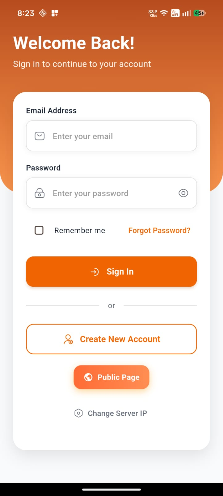
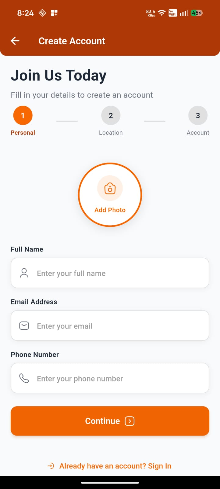
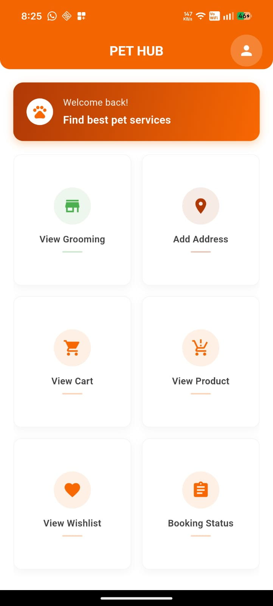
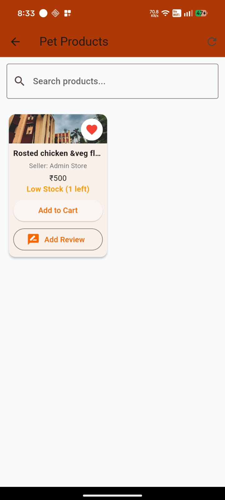
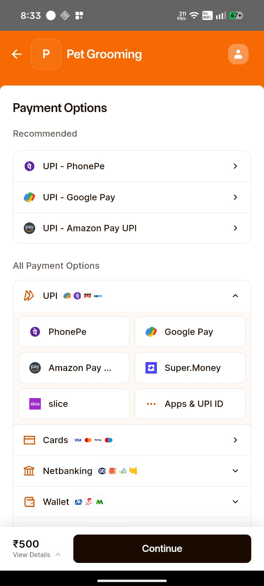
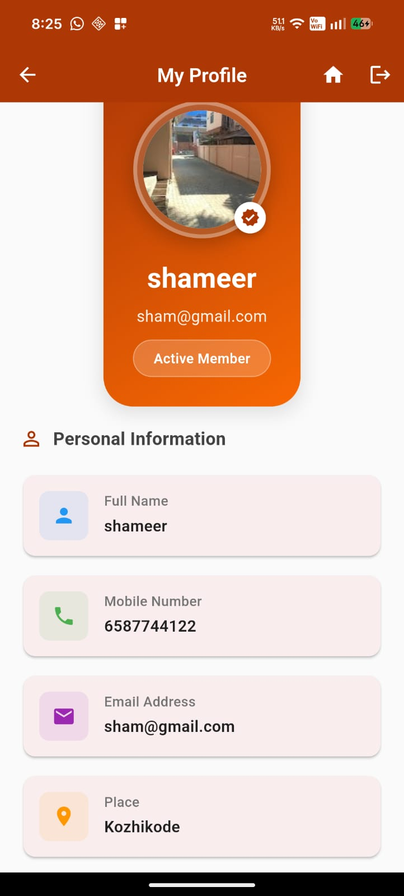

# 🐾 Pet Grooming Management System

A Full Stack Pet Grooming Management System built using Django, Flutter, REST API, and MySQL.

## 🚀 Features

- User Registration & Login
- Pet Grooming Service Booking
- Product Management
- Shopping Cart & Wishlist
- Order Management
- Online Payment Integration
- Admin Dashboard
- Staff Dashboard
- Sales Reports
- Customer Management

## 🛠️ Tech Stack

- Python
- Django
- Flutter
- REST API
- MySQL
- HTML
- CSS
- JavaScript
- Bootstrap

## 📱 Mobile Application

- Customer Login
- Registration
- Product Listing
- Grooming Booking
- Cart
- Wishlist
- Payment
- Profile

## 💻 Web Application

- Admin Dashboard
- Staff Dashboard
- Product Management
- Grooming Service Management
- Order Management
- Reports

> This project was developed for learning and portfolio purposes.
## 📱 Flutter Mobile Application

### Login

### Register

### Home

### Products

### Payment

### Profile

